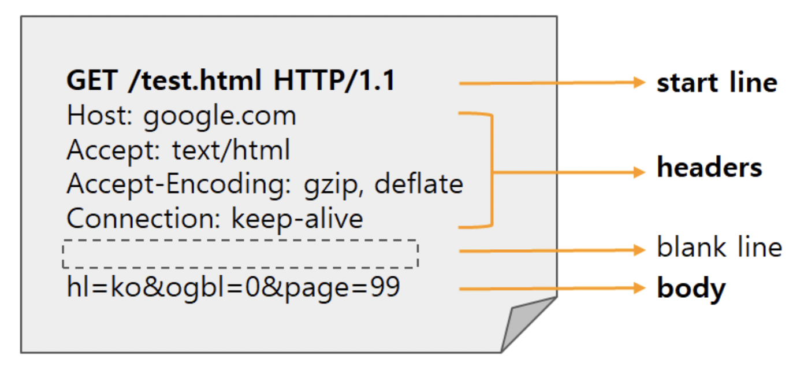
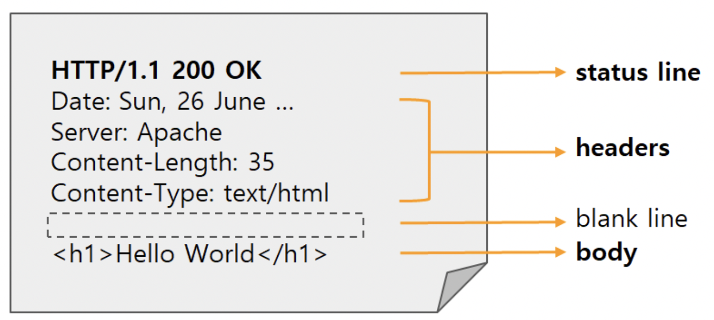

### HTTP란?
- HTTP(Hypertext Transfer Protocol)란 웹 클라이언트와 웹 서버간 데이터를 주고 받는데 사용되는 프로토콜
  - 프로토콜? 컴퓨터 내부 또는 컴퓨터 사이에서 데이터의 교환 방식을 정하는 규칙 체계
- 웹에서 이루어지는 모든 데이터 교환의 기초
### HTTP 기반 시스템의 구성요소
  - HTTP는 클라이언트 - 서버 모델을 기반으로 동작
  - 클라이언트가 양식에 맞춰 요청(request)를 보내면, 서버는 요청을 처리하고 응답(response)을 제공함
### HTTP 특징
  - 무상태성
    - 상태를 유지하지 않는 Stateless프로토콜로, 서버는 각각의 요청을 별개의 것으로 처리함
    - 즉 이전 요청의 정보는 저장하지 않음
  - 비연결성
      - 요청과 응답이 한 번 이루어지면 연결을 끊음
      - 이전 요청과 응답 정보를 유지하지 않아 서버 부하는 줄일 . 수있지만 새로운 연결을 맺는데 시간이 소요될 수 있음
  - 클라이언트 - 서버 구조
      - Request/Response 구조로 통신함
      - 서버에 클라이언트가 서버에 요청(Request)을 보내고, 서버는 클라이언트에게 응답(Response)을 보냄
      - 요청과 응답은 HTTP 메시지 형식으로 주고 받음
  ### HTTP 메시지
  - HTTP는. Request/Response 구조로 통신하여 각각의 메시지가 존재함
    #### Request 메시지
    - 공백(Blank line)을 제외하고 3가지 부분으로 나뉘어짐
      - Request 구조  
        
          - Start Line
              - HTTP Request Message의 시작라인
              - HTTP method
                  - 요청의 의도를 담음 (아래에서 자세히 설명)
              - Request target
                  - HTTP Requset가 전송되는 목표 주소
              - HTTP version
                  - version에 따라 Request 메시지 구조나 데이터가 다를 수 있기 때문에 명시함
          - Headers
              - 해당 request에 대한 추가 정보를 담은 부분
              - 크게 4종류로 나뉨
                  - General header
                      - 요청과 응답 모두에 적용되지만 바디에서 최종적으로 전송되는 데이터와는 관련이 없는 헤더
                  - Request header
                      - 페치될 리소스나 클라이언트 자체에 대한 자세한 정보를 포함하는 헤더 (내가 보내는 메세지의 헤더)
                  - Response header
                      - 위치 또는 서버 자체에 대한 정보(이름, 버전 등)와 같이 응답에 대한 부가적인 정보를 갖는 헤더 (내가 받은 메세지의 헤더)
                  - Entity header
                      - 컨텐츠 길이나 MIME 타입과 같이 엔티티 바디에 대한 자세한 정보를 포함하는 헤더
          - Body
              - HTTP Request가 전송하는 데이터를 담고 있음
              - 전송 데이터가 없으면 해당 부분 비어있음
              - post 요청의 경우 HTML 폼 데이터가 포함됨
      #### Response 메시지
      
        - status line
            - HTTP Response의 상태를 간략히 나타내고, 3가지 부분으로 구성됨
                - HTTP version
                - Status Code
                    - Response의 상태 코드
                - Status Text
        - headers
            - Request의 headers와 거의 동일하지만, response에서만 사용되는 header 값 존재(
            - 예를 들어 User-Agent 대신에 Server 헤더가 사용됨
        - body
            - Request의 body와 일반적으로 동일함
### HTTP Method
  - HTTP 메서드는 클라이언트가 서버에 요청을 보낼 때 사용되는 행동을 정의하는 방법
  - HTTP 메서드는 요청 해더(Request Header)에 포함되며, 서버는 이를 통해 클라이언트가 원하는 동작을 이해하고 처리함
  - 주로 사용하는 HTTP 메서드는 아래와 같음
#### GET (리소스 조회)
  - 서버에 전달하고 싶은 데이터는 query(쿼리 파라미터, 쿼리 스트링)를 통해 전달
  - 메시지 바디를 사용해 전달 가능하지만 지원하는 곳이 많지 않아 권장x  
#### POST(요청 데이터 처리. 즉 등록에 사용)
  - 메시지는 바디를 통해 서버로 요청 데이터 전달
  - 서버는 요청 데이터를 처리
  - 메시지 바디를 통해 들어온 데이터를 처리하는 모든 기능 수행
  - 주로 전달된 데이터로 신규 리소스 등록, 프로세스 처리에 사용
 #### PUT(리소스 대체, 해당 리소스가 없으면 생성)
  - 리소스가 있으면 대체하고, 없으면 생성함 (덮어쓰기)
  - 클라이언트가 리소스를 식별하여, 리소스 위치를 알고 URI 지정
  - 클라이언트가 리소스 위치를 모르는 POST 요청과 차이 존재
 #### PATCH(리소스 부분 변경)
  - 리소스의 일부분 변경
 #### - DELETE(리소스 삭제)
  - 지정 리소스를 삭제함
### HTTP Status Code
  - 1xx: Informational - 요청 정보 처리 중
    - 서버가 요청을 클라이언트에서 성공적으로 수신했으며 서버 끝에서 처리 중이라는 정보를 나타냄
    - 서버의 임시 응답이며 일반적으로 상태 줄과 선택적 헤더 만 포함하며 빈 줄로 끝나고 현재는 거의 사용하지 않음
  - 2xx: Success - 요청을 정상적으로 처리함
    - 서버가 요청을 받고 성공적으로 처리되었음을 나타냄
  - 3xx: Redirection - 요청을 완료하기 위해 추가 동작 필요
    - 브라우저는 자동으로 다른 URL로 리디렉션되므로 브라우저 창에는이 코드가 표시되지 않지만, 이미지 파일처럼 캐싱된 파일을 새로고침 후 확인하면 3xx 코드를 확인할 수 있음
  - 4xx: Client Error - 서버가 요청을 이해하지 못함
    - 서버가 해결할 수 없는 클라이언트 측 에러 코드
    - 주로 클라이언트(사용자)가 서버에 잘못된 요청을 했을 경우 발생한다.
    - 5xx: Server Error - 서버가 요청 처리 실패함
    - 서버가 클라이언트의 요청을 처리하지 못했을 때 발생
    - 서버는 보안 상 통신하지 않는 것이 가장 좋으므로 대부분의 에러 코드를 500 Error로 처리함

  
 

  참고  
  https://developer.mozilla.org/ko/docs/Web/HTTP/Overview
  https://hahahoho5915.tistory.com/62#Request%--Message
  https://velog.io/@ehddnr7355/HTTP%EB%9E%80