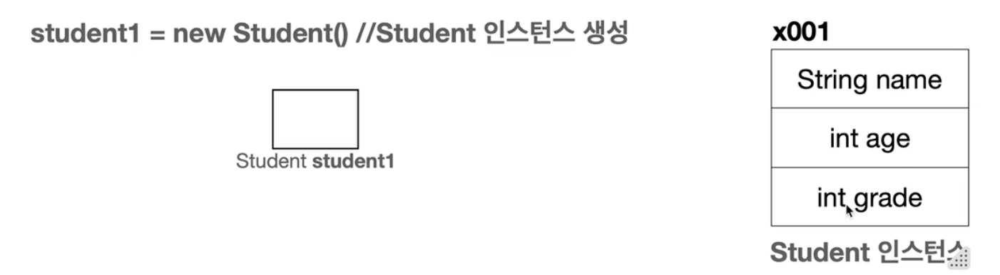
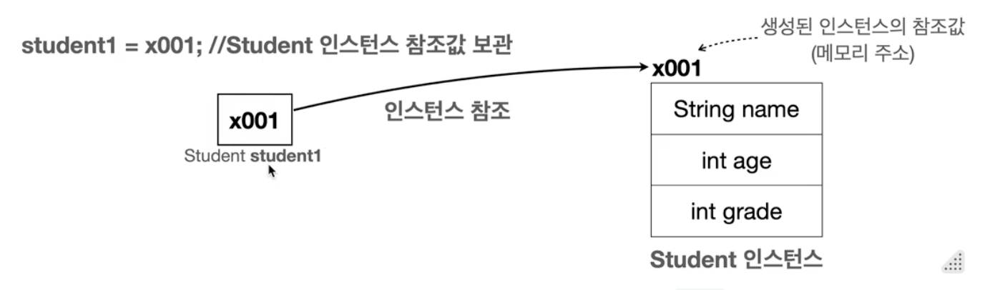
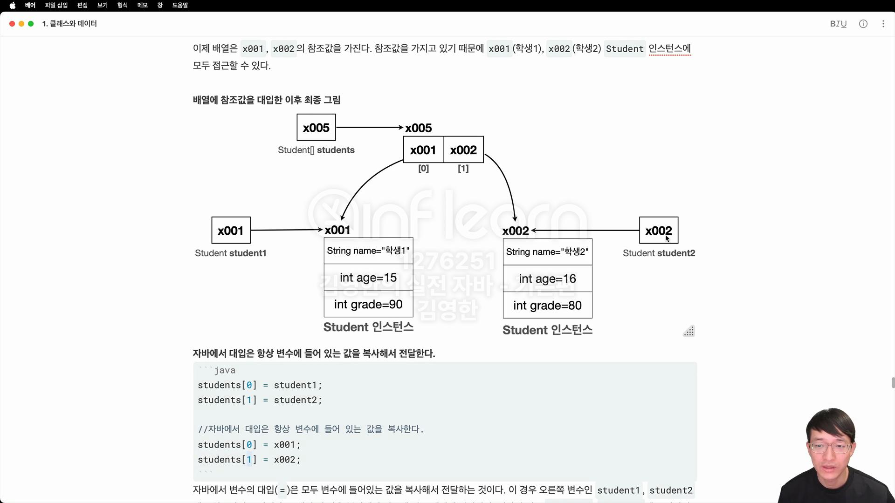

### 참고
- 배열
  - 같은 타입의 여러 변수의 묶음
   ```java
    int[] score = new int[5]; 
    ```
    - int[] score → 배열을 다루기 위한 참조 변수 ‘score’ 선언
    - new int[5] → 실제 저장 공간 생성
### 클래스와 데이터
  - 클래스란?
    - 사용자가 직접 정의하는 사용자 정의 타입의 설계도
    - int, String 과 같은 타입을 사용자가 직접 설계하는 것
    - 클래스를 사용해서 실제 메모리에 만들어진 실체를 **객체** 또는 **인스턴스**라고 함
    - ex) 붕어빵 틀 → 클래스, 틀로 만들어 낸 붕어빵→ 객체 또는 인스턴스
    - 배열 사용의 한계를 극복하기 위해 클래스를 사용함
      - 배열 사용의 한계? 배열 내 데이터 추가 및 수정, 삭제 인덱스의 순서를 항상 정확히 맞춰야 하기 때문에 실수의 가능성이 매우 높음
    - 멤버변수, 필드 → 같은 의미로 클래스에서 선언된 변수를 의미  
    
  1. 변수 선언
     ```java
     Student student1;
     ```
     - Student 타입을 받을 수 있는 변수 선언
     2. 객체 생성

     

  ```java
     Studnet student1 = new Student(); //객체(인스턴스) 생성, 실제 메모리에 만들어짐
   ```

- new Student() → Student 클래스 정보를 기반으로 새로운 객체 생성, 메모리에 실제 Studetn 객체(인스턴스)를 생성함
- Student 클래스는 String name, int age, int grade 멤버 변수를 가지고 있어, 이 **변수를 사용하는데 필요한 메모리 공간도 함께 확보**됨
3. 참조값 보관



- new 키워드를 통해 객체를 생성하면,
- 실제 메모리 어딘가에 만들어진 후,
- 해당 객체에 접근할  수 있는 참조값 (주소)를 반환함
- 앞서 선언한  Student student1에 생성된 객체의 참조값을 보관함
- 즉, student1 변수에  실제 객체의 메모리 주소를 저장하고, 해당 변수를 통해 배열에 접근하고 사용 가능함
- 참조값 확인

```java
   System.out.println(student1);
   System.out.println(student2);
                
   //결과
   class1.Student@7a81197d
   class1.Student@2f2c9b19
   ```

- @앞은 패키지 + 클래스 정보 의미,
- @뒤 16진수는 참조값 의미



- **자바에서 대입은 항상 변수에 들어 있는 값을 복사해서 전달한다**
- 변수에는 인스턴스 자체가 들어있는 것이 아님!
- 인스턴스의 위치를 가리키는 참조값이 들어있을 뿐.
- 따라서 대입()시에 인스턴스 복사가 아닌 참조값만 복사됨
