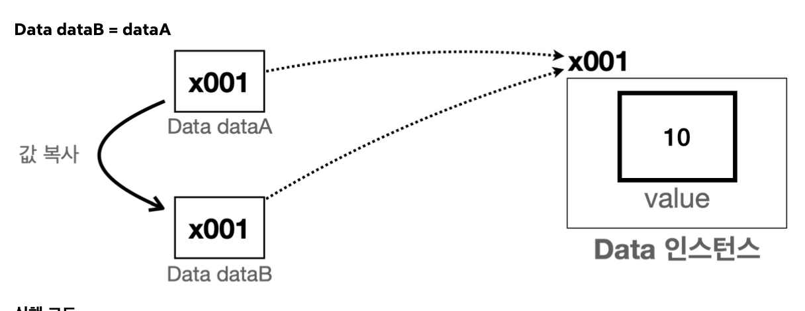

### 기본형
- 변수에 사용할 값을 직접 넣을 수 있는 데이터 타입
- int, long, double, boolean 해당
- 들어있는 값 그대로 계산 가능
### 참조형
- 데이터에 접근하기 위한 참조(주소)를 저장하는 데이터 타입
- 객체는 .(dot)을 통해 메모리 상에 생성된 객체에 접근 가능
- 객체, 배열, 클래스, String 등이 해당
- 배열은 []를 통해 메모리상에 생성된 배열에 접근 가능
- 연산 불가 (참조형 값에는 참조(주소) 값이 들어있기 때문)

### String
- 클래스로, 참조형임
- 그러나 기본형 처럼 편의 기능을 제공함

### 참고형과 기본형의 대입
- **자바는 항상 변수의 값을 복사해서 대입함**
- 기본형 대입
  - 해당 값을 복사해서 대입
- 참조형 대입
  - 실제 사용하는 객체가 아닌, 객체의 위치를 가리키는 참조 값만 복사 됨 (가르키는 포인트는 2개이지만 실제 인스턴스는 1개)
  - 즉, 같은 건물을 찾아갈 . 수있는 방법이 하나 늘어난 것  
    

      - 코드

          ```java
          Data dataA = new Data();
           dataA.value = 10;
           Data dataB = dataA;
           System.out.println("dataA 참조값=" + dataA);
           System.out.println("dataB 참조값=" + dataB);
           System.out.println("dataA.value = " + dataA.value);
           System.out.println("dataB.value = " + dataB.value); ```
                
           //DataA(참조형) 대입 값 변경
           dataA.value = 20;
           System.out.println("dataA = " + dataA.value);
           System.out.println("dataB = " + dataB.value);
                 
           //DataB(참조형) 대입 값 변경
           dataB.value = 30;
           System.out.println("dataA.value = " + dataA.value);
           System.out.println("dataB.value = " + dataB.value);
          ```

      - 실행 결과

          ```java
           dataA = ref.Data@x001
           dataB = ref.Data@x001
           dataA.value = 10
           dataB.value = 10
                 
           //DataA(참조형) 대입 값 변경
           dataA.value = 20
           dataB.value = 20
                 
           //DataB(참조형) 대입 값 변경
           dataA.value = 30
           dataB.value = 30
          ```
### 기본형과 참조형의 메서드 호출
  - 메서드의 매개변수(파라미터)는 항상 값에 의해 전달됨
  - 그 값이 실제 값인지 참조(메모리 주소)값인지에 따라 동작이 달라짐
### 변수와 초기화
  - 멤버 변수(필드)
    - 클래스에 선언
    - 인스턴스를 생성할 때 자동으로 초기화 됨
      - 숫자(int) = 0
      - boolean = false
      - 참조형 = null (참조할 대상이 없다는 뜻)
  - 지역 변수
      - 메서드에 선언, 매개변수도 지역 변수의 한 종류 (해당 지역에서만 사용 가능하다~)
      - 항상 직접 초기화 해야 함
### Null
  - 참조형 객체에 null을 할당하면 해당 인스턴스에 더이상 접근 불가
  - 자바에선 이와 같이 아무도 참조하지 않는 인스턴스가 있으면 GC(가비지 컬렉션)가 메모리에서 자동으로 제거해줌
  - 객체는 해당 객체를 참조하는 곳이 있으면 JVM이 종료할 때까지 계속 생존함
  - 중간에 해당 객체를 참조하는 곳이 모두 사라지면 필요 없는 객체로 판단하고, GC를 사용해서 제거함
### NullPointerException
  - null을 가르켜서 발생하는 오류 (결국 주소가 없는 곳을 찾아갈 때 발생하는 예외)
  - 코드
      ```java
      public class NullMain2 {
           public static void main(String[] args) {
      Data data = null;
      data.value = 10;// NullPointerException 예외 발생 System.out.println("data = " + data.value);
          } 
      }
      ```

  - 실행 결과 (에러 뜸)

    ```java
     Exception in thread "main" java.lang.NullPointerException: Cannot assign field
     "value" because "data" is null
         at ref.NullMain2.main(NullMain2.java:6)
    ```
    - null.value = 10 와 같은 의미
